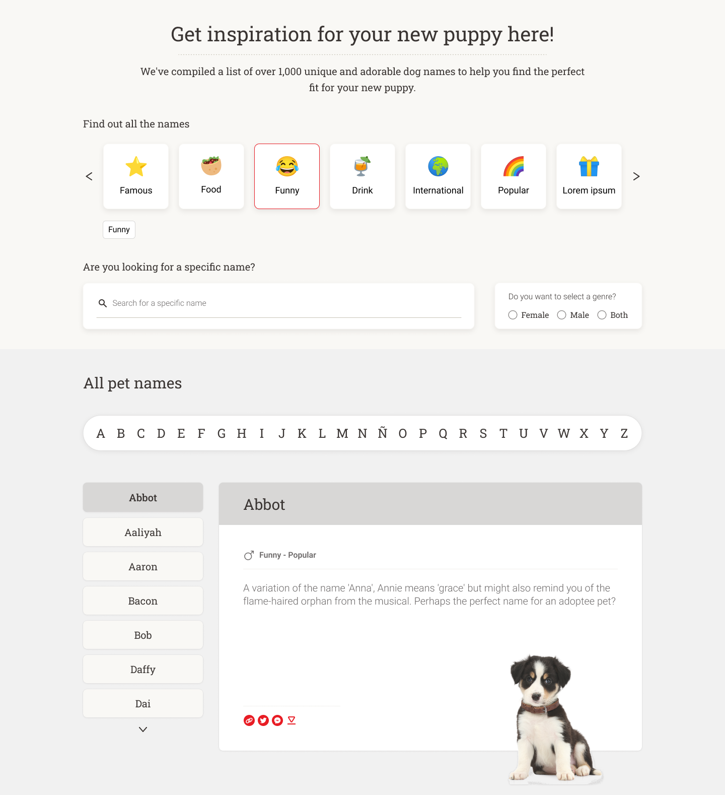

# NBS Lviv Naming Tool Ract Widget


## Technological Stack

This project was bootstrapped with [Create React App](https://github.com/facebook/create-react-app), using the [Redux](https://redux.js.org/) and [Redux Toolkit](https://redux-toolkit.js.org/) template.

Comprehensive overview of toolset used:
| Package        | Description           | NPM link  | Homepage link |
| -------------- |:---------------------:|:---------:|--------------:|
| browser-sync      |  Live reloads with any source code changing | [NPM-page](https://www.npmjs.com/package/browser-sync) | [homepage](https://browsersync.io/) |
| chackra-ui | Powerful component library for faster React development | [NPM-page](https://www.npmjs.com/package/@chakra-ui/react) | [homepage](https://chakra-ui.com/) |
| emotion | Powerful library for better css styling management | [NPM-page](https://www.npmjs.com/package/@emotion/react) | [homepage](https://emotion.sh/docs/introduction) |
| gh-pages | For publishing React application on Git Pages | [NPM-page](https://www.npmjs.com/package/gh-pages) | [homepage](https://github.com/tschaub/gh-pages) |
| react-app-rewired | Tweak for create-react-app webpack config(s) | [NPM-page](https://www.npmjs.com/package/react-app-rewired) | [homepage](https://github.com/timarney/react-app-rewired#readme) |
| react-i18next | Powerful internationalization framework for React | [NPM-page](https://www.npmjs.com/package/react-i18next) | [homepage](https://react.i18next.com/) |
| react-icons | Robust collection of popular icons for React projects | [NPM-page](https://www.npmjs.com/package/react-icons) | [homepage](https://react-icons.github.io/react-icons) |
| react-loading-overlay | A customizable, simple loading overlay with spinner and transitions | [NPM-page](https://www.npmjs.com/package/react-loading-overlay) | [homepage](https://github.com/derrickpelletier/react-loading-overlay#readme) |
| react-redux | React Application state management toolkit | [NPM-page](https://www.npmjs.com/package/react-redux) | [homepage](https://redux.js.org/) |
| react-spinners | A collection of loading spinners with React.js | [NPM-page](https://www.npmjs.com/package/react-spinners) | [homepage](https://www.davidhu.io/react-spinners/) |


## Application Look&Feel, Main React Components

Idea of this project is to provide for Nestle Purina website visitors an interactive tool for choosing a name for their new pet. In a nutshell, whole application looks like this:


As development strategy, whole application UI was divided into two main React-components saying offhand could be named like "Filter" and "View".

"Filter"-component it's a top-sitting part of application where user can choose different options for better understanding which exactly pet name he's looking for:


"View"-component is a bottom-sitting part of application where user can observe searching results depending on assumptions were set via Filter:


Both Filter and View components in turn should be subdivided into smaller React-components which implements more specific part of functionality.


## Source code top-level structure

At the top level source code of the project has following structure:
```
src
 |___app
 |___features
 |      |______filter
 |      |______view
 |
 |___i18n
 |___...[other core source files]

```
---
**features folder**
Source code of beforementioned "Filter" and "View" main react-components placed inside `features` folder in the `filter` and `view` subfolders respectively. These subfolders has following internal structure:
```
filter
  |____Filter.jsx
  |____filterSlice.js
  |____...[other sub-components and helpers ] 

view
  |____View.jsx
  |____viewSlice.js
  |____...[other sub-components and helpers ]                                                              

```
`Filter.jsx` and `View.jsx` files contains source code for "Filter" and "View" main react components respectively.
`filterSlice.js` and `viewSlice.js` files contains fragments of redux-store which relates to "Fiter" and "View" parts of application accordingly.

Maintainers of this project agreed that:

> Source code of react-components put into `.jsx`-files. Other JavaScript code put into the `.js`-files.

> Follow the approach with application subdivision by "Filter" and "View" parts and place source files into subfolders in accordance to it.

> To avoid keeping css rules in separate .css (.scss) files. Instead of doing this it's better to use Emotion library to store scss-code directly inside React component's .jsx files. It allows to simplify project's file structure managing. Using chackra-ui library is welcome as well.

---
**app folder**
The `app` folder contains static assets files and javascript files that relates to the whole app in the aggregate - not to "Filter" or "View" parts specifically. Internal structure of `app` folder looks following:
```
app
 |___apisimul
 |       |______filter
 |       |         |______...[API-simulation static files for "Filter"]
 |       |______view
 |                 |______...[API-simulation static files for "View"]
 |___images
 |      |_______...[static image assets]
 |___commonSlice.js
 |___store.js
 |___themes.js

```

`apisimul` folder contains static files simulating API-responses and using at initial development iteration, while back-end part isn't available and no async calls has been set.

`images` folder is just a storage for static images used in this project.

`commonSlice.js` file contains fragment of redux-store which relates to the whole app in the aggregate.

`store.js` it's a top-level redux-store file which assembles all application state management parts as a whole.

`themes.js` it's a file which describes all themes available for this application and defines theming parameters.

---
**i18n folder**
The `i18n` folder contains all stuff for localization. It has following internal structure:
```
i18n
 |_____locales
 |        |______...[subfolders with localization parameters per specific language]
 |                         |______translations.json
 |_____config.js

```
The `config.js` file contains the set up for the i18n instance. 

The `translations.json` file inside each of localization subfolder holds the actual text that goes in the app.


## Appliation State Management

Redux storage (`store.js`) used for apllication state management. It being divided into three parts:
    --* fragment containing state fields related to "Filter" part of application (`filterSlice.js`);
    --* fragment containing state fields related to "View" part of application (`viewSlice.js`);
    --* fragment containing common state fields related to whole application in the aggregate (`commonSlice.js`).

To have basic understanding how Redux state management organized, how to put state values into storage and take state values from there, it's recommended to read "[Redux Toolkit Quick Start](https://redux.js.org/tutorials/quick-start)" article from Redux documentation.

> Developers maintaining this project agreed to use described above Redux storage structure to organize application state management. To implement app state management developers writting actions and reducers inside proper files (`filterSlice.js`, `viewSlice.js`, `commonSlice.js`) and importing these to appropriate .jsx files.


## Localization

"Localization" means that you're making a website available in multiple languages. To localize this application `react-i18next` package has been applied. To have basic understanding how it works and how to use it it's strongly recommended to read Tom Mondloch's "[How to Add Localization (l10n) to Your React App with react-i18next](https://www.freecodecamp.org/news/how-to-add-localization-to-your-react-app/)" article published at freeCodeCamp.

To add the localization for one or the other language, developers creating appropriate subfolder inside `/i18n/locales/`,  adding `translations.json` file there and fulfill last one by translations of each text item.

> Developers maintaining this project agreed to keep in mind localization when creating text fragments of React components. What does it mean in practice? Let's say we're creating `<h1>` element containing text "I need a name".
> In such case developer must put following code fragment:
> :heavy_check_mark: `<h1>{t('view hero landing title')}</h1>`
> instead of straitforward:
> :x: `<h1>I need a name</h1>`


## Theming

One of the main goals of this project is to create reusable widget. In another words, this application can be used multiple brands (PetCare, Lilly's kitchen, ProPlan etc.). Each brand has it's own visual identity. 

Thus, in scope of this project theming means color scheme of React components (background colors and font colors). To have basic understanding how theming works with Emotion library, it's strongly recommended to read "[Theming](https://emotion.sh/docs/theming)" section of Emotion-library's documentation.

> When it comes to background- and font-colors of React components and sub-components, developers maintaining this project agreed to use `ThemeProvider` and\or `useTheme hook` from Emotion library to deliver proper color scheme values (stored inside `themes.js` file) to css- styling rules.